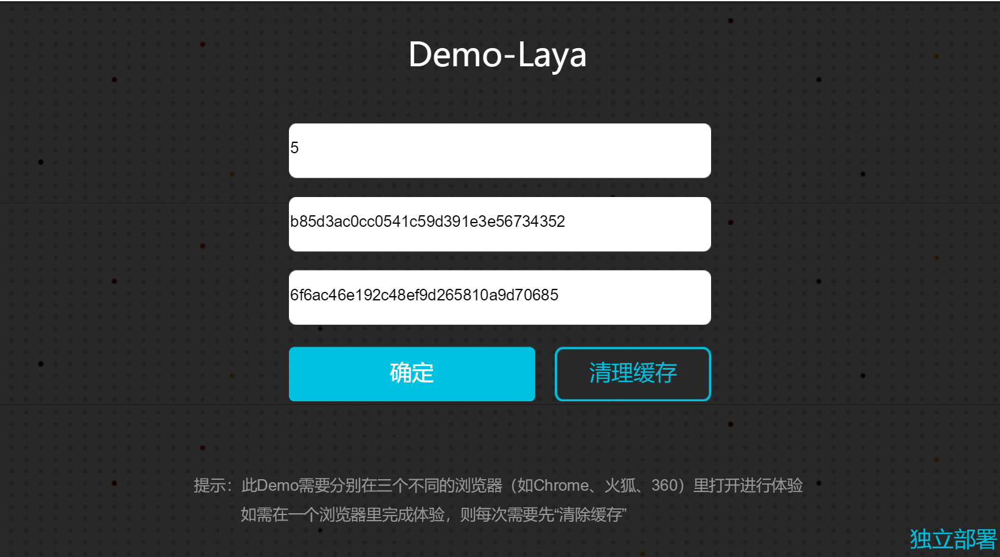
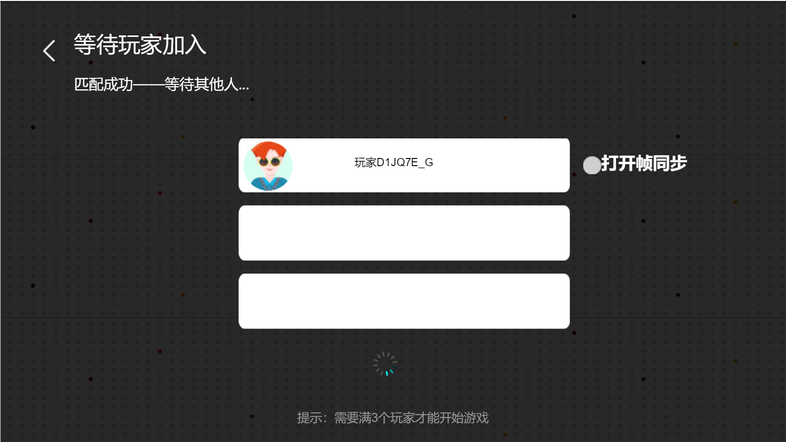

# jdge demo_laya

demo 是使用  LayaAir TypeScript 实现。演示了 jdge sdk 在laya 中使用方法。集成 jdge sdk 接口实现了注册、登录、创建房间、加入房间、踢人、同步游戏逻辑、断线重连等等主要功能。

## 环境搭建

### 下载LayaAirIDE

请到 [Laya官网](http://ldc.layabox.com/layadownload/?type=layaairide) 下载。下载好LayaAir 后解压到自定义目录即可(LayaAir 引擎 TypeScript版集成到了 IDE 中，不用另外下载LayaAir Engine)。

### 下载 jdge demo_laya

- [jdge官网](http://home-ge.matrix.jdcloud.com/serviceDownload)

获取到 demo_laya 项目直接使用LayaAirIDE 打开即可运行。


打开 demo_laya 后，可以在 LayaAirIDE 左边可以看到工程目录结构如下：


### SDK 配置

根据 Laya 官方文档，第三方库文件需要分别放在不同的目录下， `.d.ts` 文件放在工程  root目录的`libs` 目录下，`js` 文件放在 `bin/libs` 目录下， `.min.js` 文件放在 `bin/libs/min` 目录下。

```
-- 第三方库文件放置结构
demo_laya
	./bin/libs
			./min
				matchvs.min.js
			matchvs.js
	./libs
		matchvs.d.ts
```

> 注意：demo_laya 默认带有 jdge sdk 文件的，如果没有，请自行下载或者要获取最新的 jdge sdk 请到 [jdge官网](http://home-ge.matrix.jdcloud.com/serviceDownload) 下载。 

配置好 jdge sdk 后，需要到 bin/index.html 中使用 jdge 库，不然会出现 jdge 中的变量未定义问题。如下图：


### 游戏配置

src 目录是 demo源码目录，结构如下图：


- game :  是游戏对战房间参数配置目录，配置参数都在GameData 类型里，这里的参数一般是不要去修改。

```typescript
class GameData{
    public static myUser:GUser = new GUser();
    public static battleBgimgUrl:string = "";//游戏背景图片配置，如果没有配置，则在对战界面是黑色背景
    public static maxPlayerNum:number = 3; // 最大人数配置，一般这个配置不要修改，demo 只有三个角色
    public static mode:number = 0;//房间模式，与加入房间和创建房间参数有关系，请阅读SDK文档了解
    public static canWatch:number = 0;//是否可观战，与加入房间和创建房间参数有关系，请阅读SDK文档了解
    public static roomPropertyType = { "mapA": "mapA", "mapB": "mapB" };//房间属性
    public static roomPropertyValue = "mapA";//房间默认属性
    public static createRoomInfo = new MsCreateRoomInfo("MatchvsDemoLaya", 3, 0, 0, 1, "mapA"); //创建房间的参数
    //游戏中发送消息标识
    public static MSG_ACTION = {
        GAME_TIME_SYN: 2000, //重新连接后房主回复游戏数据
        BALL_MOVE:2001,     //发送球位置
        ROLE_LOCATION:2002, //发送角色位置
        RECONNECT_OK:2003,  //重新连接成功，发送消息告诉其他人OK了
        RECONNECT_ACK:2004, //重新连接后房主回复游戏数据
    }
    constructor(){
    }
}
```

- jdge : 是有关 jdge 平台的配置 和 jdge sdk 集成，集成的这个jdge模块开发者可以直接拷贝该模块的内容使用到其他的 laya 项目中，是可以直接复用的，开发者拿到demo可以 把 MsConfig 文件下的游戏信息改为开发者 在 [jdge官网注册的游戏信息](http://home-ge.matrix.jdcloud.com/manage/gameContentList) 。

```typescript
class MsConfig{
    public static channel:string = "jdge"; //渠道
    public static PLATFROM_TYPE:PlatformType = new PlatformType("alpha","release");//环境
    public static platfrom:string = MsConfig.PLATFROM_TYPE.alp;
    public static gameID:number = 201489;//游戏ID
    public static appKey:string = "4fb6406305f44f1aad0c40e5946ffe3d";
    public static secretKey:string = "5035d62b75bd4941b182579f2b8fc12c";
    constructor(){
    }
}
```

- jdge sdk 集成模块，由 MsEngine 、MsError 、MsEvent、 和 MsResponse 组成。这个模块是采用 事件触发机制，使用者只要 监听相关接口的回调事件就可以获取到回调信息，后面会展示使用方法。

```
 MsEngine: 引用 sdk MatchvsEngine
 MsError : sdk 回调接口错误定义
 MsEvent : 自定义事件
 MsResponse ：引用 sdk MatchvsResponse
```

- logic : demo ui界面继承类型，用于处理页面逻辑。
- ui : 页面定义。

## demo 代码示例介绍

开发者配置好 MsConfig 文件的游戏信息和 确认 jdge sdk 已经集成到项目中，就可以运行demo啦。界面展示如下：

- 登录界面



- 匹配界面




#### MsEngine.ts 和 MsResponse.ts 文件

这两个文件是 sdk 集成的重要文件 MsEngine 是SDK 请求函数封装，MsResponse 是SDK 回调函数封装。两个都是单例类型。接口调用 采用  MsEngine.getInstance.xxxx 的格式即可。MsResponse 是获取到回调后，会触发MsEvnet 自定义的事件，开发者可以根据自己需要修改定义的事件。MsResponse 事件监听格式采用 mvs.MsResponse.getInstance.on(mvs.MsEvent.XXXXX, this, this.Function); 

- MsEngine.ts :该文件集成了 jdge sdk 的 MatchvsEngine  类接口。源码如下：

```typescript
module mvs {
	/**
	 * 这个是 jdge 引擎 接口封装模块，对引擎的所有请求接口进行了二次封装，一些接口调用的参数可以在这里组合
	 */
	export class MsEngine {
		private static _instance = null;
		private _engine:MatchvsEngine = null; //jdge SDK 引擎 类
		public constructor() {  //这里public 可以写成 private 
			this._engine = new MatchvsEngine();
		}
		/**
		 * 获取MsEngine类实例
		 */
		public static get getInstance():MsEngine{
			if(MsEngine._instance == null){
				MsEngine._instance = new MsEngine();
			}
			return MsEngine._instance;
		}
        ......
    }
}
```

- MsResponse : jdge 回调封装，收到数据后，采用Event触发方式发出消息。在 registResponseCall 函数里重新对 MatchvsResponse 回调接口映射。

```typescript
/**
 * 对 MatchvsResponse 回调接口 进行封装，使用 事件触发的机制 对消息进行处理，调用者只需要在使用的时候接受该事件消息，然后释放即可
 */
module mvs {
	//import laya.display.Sprite;
	import Sprite = Laya.Sprite;
	import Event = Laya.Event;
	export class MsResponse extends Sprite{
		private static _instance:MsResponse = null;
		private _response:MatchvsResponse = null; //jdge SDK 引擎 MatchvsResponse 类
		public constructor() {//这里public 可以写成 private 
			super();
			this.registResponseCall();
		}
		/**
		 * 获取实例
		 */
		public static get getInstance():MsResponse{
			if(MsResponse._instance == null){
				MsResponse._instance = new MsResponse();
			}
			return MsResponse._instance;
		}
		public static release(){
			MsResponse._instance._response = null;
			MsResponse._instance = null;
		}
		/**
		 * 获取引擎回调
		 */
		public getResponse():MatchvsResponse{
			if(this._response == null){
				this.registResponseCall();
			}
			return this._response;
		}
		/**
		 * MatchvsResponse 接口回调的重新注册
		 */
		private registResponseCall(){
			this._response = new MatchvsResponse();
			this._response.initResponse = this.initResponse.bind(this);
			this._response.registerUserResponse = this.registerUserResponse.bind(this);
			this._response.loginResponse = this.loginResponse.bind(this);
			this._response.joinRoomResponse = this.joinRoomResponse.bind(this);
			this._response.joinRoomNotify = this.joinRoomNotify.bind(this);
            ......
		}
    }
}

```

#### 初始化

- jdge 初始化(init):  调用 MsEvent 类的初始化接口，MsResponse 收到 initResponse 

```typescript
// MvEvent.ts 初始化
public init(channel:string, platform:string, gameID:number):number{
    this._response = MsResponse.getInstance.getResponse();
    let res = this._engine.init(MsResponse.getInstance.getResponse(),channel,platform,gameID);
    if (res !== 200){
        console.info("[MsEngine init failed] resCode:",res);
        return res;
    }
    console.info("[MsEngine init seccess] resCode:",res);
    return res;
}

// MvResponse 初始化回调
private initResponse(status:number){
    //收到回调，发送 Event 自定义事件
    this.event( MsEvent.EVENT_INIT_RSP,new MsEventData({status:status}));
}

```

- 使用示例：

```typescript
//demo_laya/src/logic/Login.ts
/**
 * 打开 jdge 事件监听, MsResponse 回调监听
 */
private addMvsListener(){
    // 初始化监听
    mvs.MsResponse.getInstance.on(mvs.MsEvent.EVENT_INIT_RSP, this, this.initResponse);
    ......
}

/**
 * 移除 jdge 事件监听， MsResponse 回调监听
 */
private removeMvsListener(){
    mvs.MsResponse.getInstance.off(mvs.MsEvent.EVENT_INIT_RSP, this, this.initResponse);
    ......
}

private btnOkClick(e:Laya.Event){
    /**
     * set jdge 初始化需要的信息
     */
    this.setMsConfigInfo();
    // 调用 MsEngine 的 初始化函数
    mvs.MsEngine.getInstance.init(MsConfig.channel, MsConfig.platfrom, MsConfig.gameID);
}
   
private initResponse(event:mvs.MsEventData){
    if(event.data.status == 200){
       ......
    }else{
        console.info("初始化失败！");
    }
}
```

#### 注册

- MvEvent.ts 和 MsResponse.ts 文件定义

```typescript
//MvEvent.ts 请求
public registerUser():number{
    let res = this._engine.registerUser();
    if (res !== 0){
        return res;
    }
    return res;
}
//MsResponse.ts 回调
private registerUserResponse(userInfo:MsRegistRsp){
    // 发送 自定义事件
    this.event(MsEvent.EVENT_REGISTERUSER_RSP,new MsEventData(userInfo));
}
```

- 使用示例：

```typescript
//demo_laya/src/logic/Login.ts
private addMvsListener(){
    // 注册监听
    mvs.MsResponse.getInstance.on(mvs.MsEvent.EVENT_REGISTERUSER_RSP,this, this.registUserResponse);
    ......
}

/**
 * 移除 jdge 事件监听， MsResponse 回调监听
 */
private removeMvsListener(){
   mvs.MsResponse.getInstance.off(mvs.MsEvent.EVENT_REGISTERUSER_RSP,this, this.registUserResponse);
    ......
}


private initResponse(event:mvs.MsEventData){
    if(event.data.status == 200){
       //请求注册用户
       mvs.MsEngine.getInstance.registerUser();
    }else{
        console.info("初始化失败！");
    }
}
 
 private registUserResponse(event:mvs.MsEventData){
     let data = event.data;
     if(data.status == 0){
     }else{
         console.info("注册用户失败：",data);
     }
     return;
 }
```

#### 登录

- MvEvent.ts 和 MsResponse.ts 文件定义

```typescript
//MvEvent.ts 请求
public login(userID:number, token:string, gameID:number, appkey:string, secretkey:string):number{
    let res = this._engine.login(userID,token,gameID,1,appkey,secretkey,"eglejjddg",0);
    return res;
}
//MsResponse.ts 回调
private loginResponse(login:MsLoginRsp){
    // 登录回调 发送自定义事件
    this.event(MsEvent.EVENT_LOGIN_RSP, new MsEventData(login));
}
```

- 使用示例：

````typescript
//demo_laya/src/logic/Login.ts
private addMvsListener(){
    // 登录 监听
    mvs.MsResponse.getInstance.on(mvs.MsEvent.EVENT_LOGIN_RSP,this, this.loginResponse);
    ......
}

/**
 * 移除 jdge 事件监听， MsResponse 回调监听
 */
private removeMvsListener(){
    mvs.MsResponse.getInstance.off(mvs.MsEvent.EVENT_LOGIN_RSP,this, this.loginResponse);
    ......
}

private registUserResponse(event:mvs.MsEventData){
    let data = event.data;
    if(data.status == 0){
        //设置用户信息
        this.setUserInfo(data);
        //登录请求
        mvs.MsEngine.getInstance.login(GameData.myUser.userID,GameData.myUser.token, MsConfig.gameID, MsConfig.appKey, MsConfig.secretKey);

    }else{
        console.info("注册用户失败:",data);
    }
    return;
}
// 登录回调 事件触发函数
private loginResponse(event:mvs.MsEventData){
    let data = event.data;
    if(data.status == 200){
        this.removeMvsListener();
        if(data.roomID !== "0"){
            console.info("登录成功！可以重新连接:"+data.roomID);
            StageManage.getInstance.SwitchScreen(ReConnect);
        }else{
            console.info("登录成功！跳到大厅");
            //这里页面跳转
            StageManage.getInstance.ToLobby();
        }
    }else{
        console.info("登录失败！");
    }
}

````

#### 随机加入房间

- MvEvent.ts 和 MsResponse.ts 文件定义

```typescript
//MvEvent.ts 请求
public joinRandomRoom(maxPlayer:number, userProfile:string):number{
    let res = this._engine.joinRandomRoom(maxPlayer,userProfile);
    console.info("[MsEngine joinRandomRoom ] resCode:",res);
    return res;
}
//MsResponse.ts 回调
/**
* 加入房间回调
*/
private joinRoomResponse(status:number, roomUserInfoList:Array<MsRoomUserInfo>, roomInfo:MsRoomInfo){
    if(status == 200){
        let data = {
            status:status,
            userList:roomUserInfoList,
            roomInfo:roomInfo
        }
        this.event(MsEvent.EVENT_JOINROOM_RSP, new MsEventData(data));
        return ;
    }
    return;
}
/**
* 加入房间异步回调 发送 event 事件
*/
private joinRoomNotify(roomUserInfo:MsRoomUserInfo){
    let data = {
        userId : roomUserInfo.userId, 
        userProfile : roomUserInfo.userProfile};
    this.event(MsEvent.EVENT_JOINROOM_NTFY, new MsEventData(data));
}
```

- 使用示例：

```typescript
//demo_laya/src/logic/Match.ts
private addMvsListener(){
    //加入房间事件
    mvs.MsResponse.getInstance.on(mvs.MsEvent.EVENT_JOINROOM_RSP,this, this.joinRoomRsp);
    mvs.MsResponse.getInstance.on(mvs.MsEvent.EVENT_JOINROOM_NTFY,this, this.joinRoomNotify);
    ......
}

/**
 * 移除 jdge 事件监听， MsResponse 回调监听
 */
private removeMvsListener(){
    mvs.MsResponse.getInstance.off(mvs.MsEvent.EVENT_JOINROOM_RSP,this, this.joinRoomRsp);
    mvs.MsResponse.getInstance.off(mvs.MsEvent.EVENT_JOINROOM_NTFY,this, this.joinRoomNotify);
    ......
}    
//随机加入房间
private joinRandRoom(){
    let userPro:string = JSON.stringify({name:GameData.myUser.name, avatar:GameData.myUser.avatar});
    mvs.MsEngine.getInstance.joinRandomRoom(GameData.maxPlayerNum,userPro);
}

private joinRoomRsp(e:mvs.MsEventData){
    let data = e.data;
    if(data.status == 200){
        //加入房间成功
    }else{
        //加入失败
    }
}
private joinRoomNotify(e:mvs.MsEventData){
    let data = e.data;
    //有人加入房间
}
```

所有的接口请求监听回调都是如上示例：如果哪里需要用到就添加监听，不要了就取消掉监听。

#### 错误处理

错误处理在 src/logic/ErrorNote.ts 这里执行的。错误代码映射是在 matchvs/MvError.ts里，错误回调只用监听。

```typescript
module mvs {
    export class MsError{
        //错误码集合
        private _errMap:{[key:number]:string} = [];

        constructor(){
            this.init();
        }
        private init(){
            this._errMap[1001] = "您的【游戏】连接断开, 需要重新登录...";
            this._errMap[1002] = "您的【房间】连接断开, 请重开游戏...";
            this._errMap[406] = "房间已经关闭...";
            this._errMap[405] = "房间人已经满了...";
            this._errMap[404] = "找不到您要的信息...";
            this._errMap[500] = "游戏服务器错误...";
            this._errMap[402] = "用户信息验证错误...";
            this._errMap[-2] = "未初始化";
            this._errMap[-6] = "已经在房间";
        }
        /**
         * 添加错误说明
         */
        public addErrMsg(code:number, msg:string){
            this._errMap[code] = msg;
        }
        public getErrMsg(code):string{
            return this._errMap[code];
        }
    }
}
```

使用示例代码如下：

````typescript
//demo_laya/src/logic/ErrorNote.ts
//监听事件
private errMap:mvs.MsError ;
public addListen(caller:any ){
    this.currnPage = caller;
    mvs.MsResponse.getInstance.on(mvs.MsEvent.EVENT_ERROR_RSP, this, this.errorResponse);
}
//取消监听
public delListen(){
    mvs.MsResponse.getInstance.off(mvs.MsEvent.EVENT_ERROR_RSP,this, this.errorResponse);
}

private errorResponse(e:mvs.MsEventData){
    let code:number = e.data.errCode;
    let msg:string = e.data.errMsg;
    let errmsg = this.errMap.getErrMsg(code);
	......
}

````


### 更多

- 更多资料请参考 [jdge官网文档](http://doc-ge.matrix.jdcloud.com/Jdge)
- 有疑问可以在控制台发送工单或发邮件咨询 ：hanyongxiang@jd.com